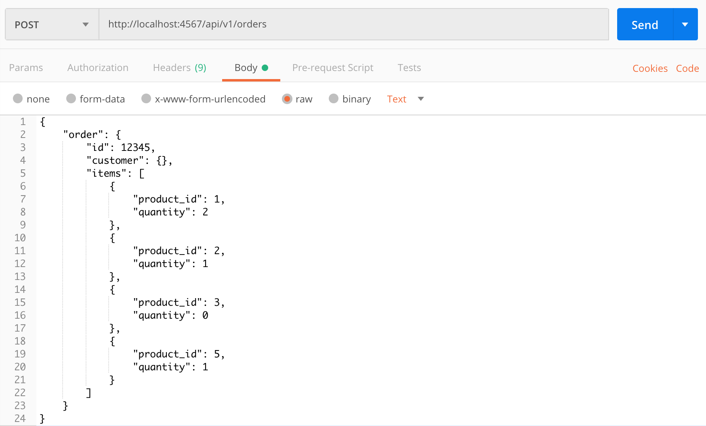
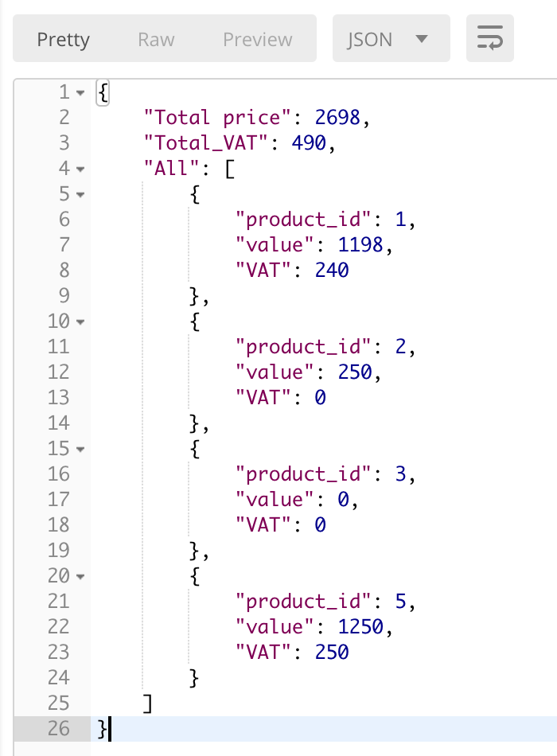
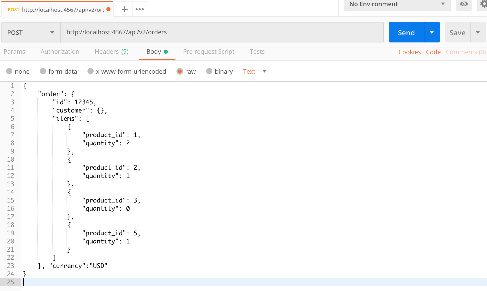
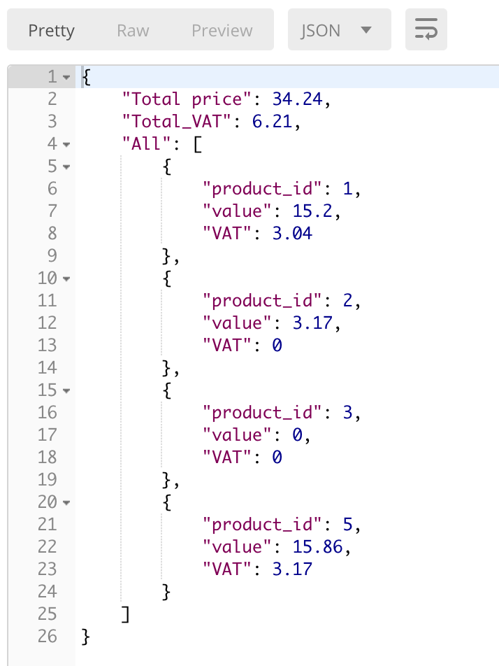
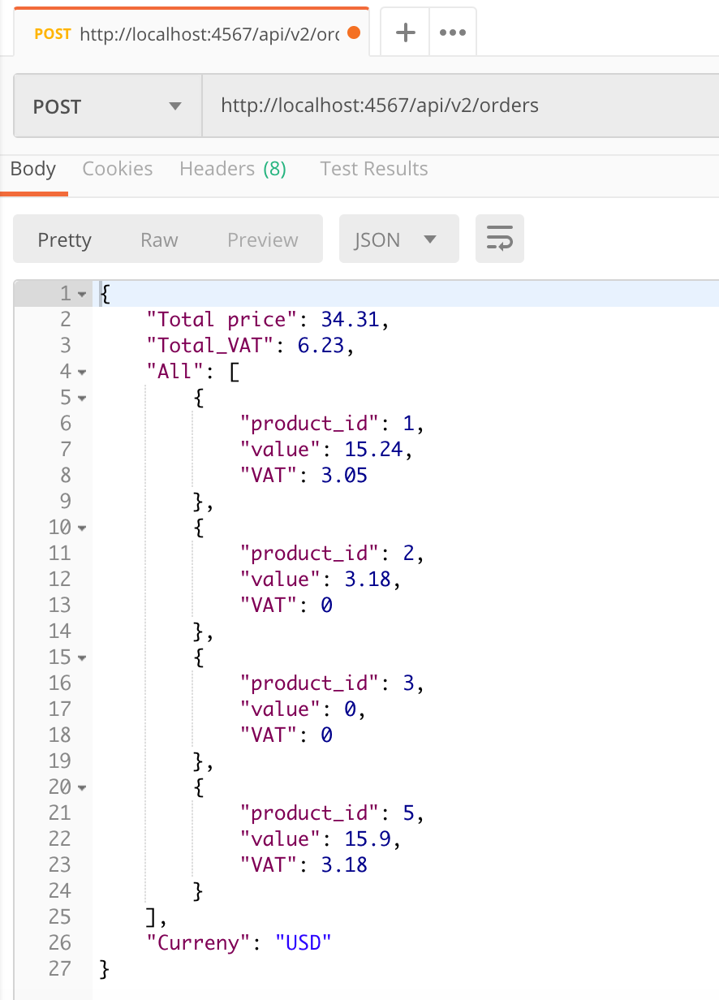

# Have access to different files inside the repository:

1. The ruby files related to the models are in "lib" folder.

2. The test files are in the "spec" folder.

3. The required file for running the server is "server.rb" file.

4. I have used Sinatra framework for building the API.

5. I have used Rspec as the testing framework.

# How to install and start the server

1. At first you can clone or fork the repository from [here](https://github.com/soroushh/Tails)!

2.  After making sure you have Ruby installed on your machine, you should install "bundler" gem in your machine by the following command:

``` gem install bundler ```

3 . After installing the "bundler", you should use it to install the dependencies (gems) by running the following command:

``` bundle install ```

4. After installing all dependencies, you can run the server by running the following command on your command line:

``` ruby server.rb ```

After running the server.rb file, you can have access to your server in the following url in your browser.

http://localhost:4567

After starting the server, you can make Post requests to the server and receive the response in "json" format.

## Proper requests to the API and the received response

As you see in the server.rb file, there are two versions of "v1" and "v2" API.

### v1 API

This version of API, receives Post requests with json body.
After starting the server, you can send a Post request to the following url. I have used Postman to send the Post request as you see in the follwing picture.
``` http://localhost:4567/api/v1/orders ```


The respond of the API, will be in json format as you see in the below picture. The important point is the unit of all numbers in the response is "penny" and they have been rounded by the accuracy of 1. (one penny)

As you see in the above picture, in the response, we have total price which is the sum of price of all products in the order. The total VAT is the sum of all VATs of all products. finally, you see All which shows the price and VAT of each product. All the prices and VATs are in pennies and they have the accuracy of one penny.

### v2 API

This version of API is an extended version of v1 API. in this version, you will add "currency" to your request and the prices and the VAT in the respond will be in the currency that you have entered in the request with the accuracy of 0.01.

 The proper Post request format is shown in the following picture. As you see, you should add the "currency" to the body of your post request and the value for it will be the code of the currency you want to use. In order to get a list of the code of different currencies, you can have a look at the [https://free.currencyconverterapi.com](https://www.currencyconverterapi.com/docs). For example, the code of dollar is "USD".

In order to use v2 version of API, after starting the server, you can send a Post request to the following url.
``` http://localhost:4567/api/v2/orders ```

I have used Postman to send the post request and you see the proper format of the request body in the following picture.



The response will be in json format and all numbers' unit will be the currency you entered in the request with the accuracy of 0.01.



## Tests

I have used Rspec framework to test the pricing logic for the problem. The test file is inside the "spec" folder. to run the tests, you can run the following command in the command line:

``` rspec ```

## If I had more time

If I had more time, I would try to add some tests for the API itself. At the moment, I have written some unit tests for testing the calculation of price and VAT in my order model.
To test the API, I run the server, then I send some post requests with proper body to the server by Postman. Then, I check that if the response is in the correct format and it shows the total_price, total_VAT and separated price and VAT for each product correctly or not. This can be automated and if I had more time, I would try to search a bit more to find proper way of testing the API call.

If I had more time, I would also work on the error handling. In fact, I would work on the server to show proper errors when it receives requests which don't have a proper body.

## What I am proud of
I haven't  built any API before this test. I have used several APIs but it was my first time that I build one myself that receives a Post request with json body and responses in json format. This shows that I can learn new concepts and  apply them. At first, I tried to search about building APIs in Sinatra, then I built it step by step and now, it is working.

## The Thoughest bits

In my v2 API, I used two classes. One of them was responsible for checking the order and calculating the price, VAT and separating the order for different items. The other class is responsible for making a connection to another currency conversion API to receive the exchange_rate, therefore in I had to get data from request body two times. When I tried to get data from request body two times in my server file, the server did not work.  After being stuck about two hours and searching a lot, I understood I could use the following piece of code to be able to have access to request body two times.

 ```before do``` </br>
    &nbsp; &nbsp; ```request.body.rewind``` </br>
    &nbsp; &nbsp;   ```@request_payload = JSON.parse request.body.read``` </br>
    ``` end ```

Then, I used "@request_payload" variable in my server file to have access to the request body for more than one time.


## Why only one endpoint ???

As you see in my server.rb file, I have only used one endpoint for both v1 and v2 APIs. The reason is that there are only 5 products. In adittion, I am not designing an API for a server which is used by a big company that has many clients and the server is called many times. I am just designing it for a test.
 If the server is called many times by clients, it would be a better idea to separate endpoints, because a lot of customers only need certain amount of information, so it is not good to get extra information by the endpoint. In addition, it increases the cost of data storage and management in big scales.

 ## How to make the test more clear and better
 There is nothing that specifies what is the required accuracy for showing the prices and VATs in foreign currencies like USD. Is the accuracy 1 (dollar) or 0.01 (cent) in the response price and VAT ? It would be better to specify the required accuracy in the test.
 At the moment, there are three requirements for the endpoint. It should shows the following things in it : </br>
 the total price for the order</br>
the total VAT for the order</br>
the price and VAT for each item in the order </br>
It would be good to add another requirement to show the currency that prices and VATs should be paid at. By adding that requirement, the response would be like the following picture, including the currency.

